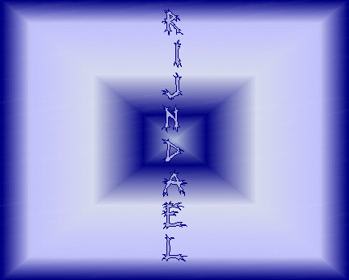



## RijnDael Block Cipher

### Description

This is the first ever VB implementation of the RijnDael (pronounced Reign Dahl) block cipher algorithm. This form of encryption has recently been adopted as the Advanced Encryption Standard - the standard which is set to replace DES, the way that most encryption is done nowadays.
 
### More Info
 

             |
---                |---
**Submitted On**   |2001-01-12 09:35:16
**By**             |[BigCalm](https://github.com/Planet-Source-Code/PSCIndex/blob/master/ByAuthor/bigcalm.md)
**Level**          |Advanced
**User Rating**    |4.5 (18 globes from 4 users)
**Compatibility**  |VB 6\.0
**Category**       |[Encryption](https://github.com/Planet-Source-Code/PSCIndex/blob/master/ByCategory/encryption__1-48.md)
**World**          |[Visual Basic](https://github.com/Planet-Source-Code/PSCIndex/blob/master/ByWorld/visual-basic.md)
**Archive File**   |[CODE\_UPLOAD136981122001\.zip](https://github.com/Planet-Source-Code/bigcalm-rijndael-block-cipher__1-14313/archive/master.zip)

